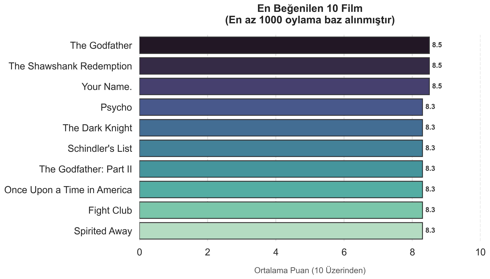

# Movie Data Analysis

Bu proje, Kaggle'dan alınan kapsamlı bir sinema veri seti üzerinde gerçekleştirilmiş bir **Keşifçi Veri Analizi (EDA - Exploratory Data Analysis)** çalışmasıdır. Veri bilimi teknikleri kullanılarak veri seti temizlenmiş, manipüle edilmiş ve sinema dünyasına dair anlamlı içgörüler görselleştirilmiştir.
## 📊 Öne Çıkan Analiz: Gerçek Popülerliği Ölçmek
Bu analizin ilk aşamasında, sadece 1-2 kişinin yüksek puan verdiği filmlerin ortalamayı bozmasını (outlier) engellemek amaçlanmıştır. 
* **Filtreleme:** Sadece **en az 1000 oy almış** filmler analize dahil edilmiştir.
* **Sonuç:** Oy sayısına göre güvenilirliği kanıtlanmış filmler arasından en yüksek puana sahip **Top 10 Film** listesi çıkarılmıştır.

###  En İyi 10 Film Görselleştirmesi
Aşağıdaki grafik, Seaborn kütüphanesi ile veri etiketleri (data labels) eklenerek yüksek çözünürlükte (300 dpi) oluşturulmuştur:

